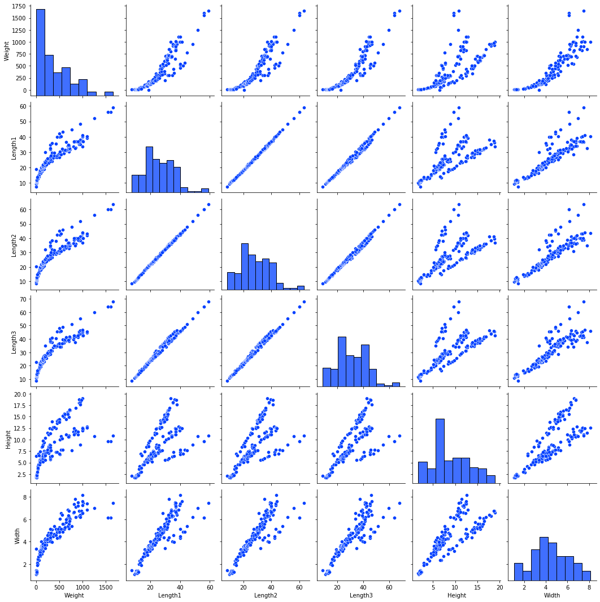

# Fish Dimensions Regression Analysis

### Introduction

The Fish Dimension Regression Analysis repo aims to preform statistical analysis on the given fish market dataset. The analysis involves hypothesis testing and preforming a multi-dimentional linear regression on the dataset.

**Gallery**



### Usage

**Interactive Web Application**

A Dash web application has been created on Heroku servers to demonstrate the linear regression (Ordianry Least Sqaured) predictive model. The interactive model takes user inputs on a given fish’s vertical length, diagonal length, horizontal length, height, width and predicts a target fish weight. 

# Overview of Statistical Analysis on Dataset

**The Dataset**

The dataset includes seven features containing categorical and numerical data on fish species, weight, and five length measurements. The dataset was created by Aung Pyae and is hosted on the website [kaggle.com](https://www.kaggle.com/aungpyaeap/fish-market). The dataset is optimal for regression modeling as there is strong correlation between fish length and fish weight. During linear regression analysis the “Weight” feature is used as the target feature.

Features:

Species (str): The type of fish
Weight (int): The recorded Weight of the fish in grams (g)
Length1 (int): Vertical length in centimeters (cm)
Length2 (int): Diagonal length in centimeters (cm)
Length3 (int): Cross length in centimeters (cm)
Height (int): Height in centimeters (cm)
Width (int): Diagonal width in centimeters (cm)

 **Weight Distribution**

 

**Central Limit Theorem and Effect on Weight Distribution**


**Dimensionality Reduction**

Using the features “Length3”, ”Height”, and “Width” a feature “Volume” can be created that has a strong correlation to fish weight. Additionally, a higher R2 score is achieved with the addition of the “Volume” feature as it explains more variation around the mean when compared to the other features individually.


**Hypothesis Testing**

Null Hypothesis:

The coefficient of our compared features to target will be equal to zero

Alternative Hypothesis:

The coefficient of our compared features to target will not be equal to zero

**Graphed Linear Regression and 95% Confidence Intervale**


**Inference for Linear Regression**

It is found that the R2 and Adj. R2 values (the percentage of variation that can be explained by the feature) rank at 0.961 and 0.960 which is a notable improvement from the 0.88 Adj. R2 value before the volume dimensionality reduction feature. Overall, we reject the Null Hypothesis since the p-values are equal to zero and are below the set p-value threshold of 0.05.

```
                            OLS Regression Results                            
==============================================================================
Dep. Variable:                 Weight   R-squared:                       0.961
Model:                            OLS   Adj. R-squared:                  0.960
Method:                 Least Squares   F-statistic:                     629.7
Date:                Tue, 07 Dec 2021   Prob (F-statistic):          1.22e-104
Time:                        17:27:19   Log-Likelihood:                -901.52
No. Observations:                 159   AIC:                             1817.
Df Residuals:                     152   BIC:                             1839.
Df Model:                           6                                         
Covariance Type:            nonrobust                                         
==============================================================================
                coef    std err          t      P>|t|      [0.025      0.975]
------------------------------------------------------------------------------
Intercept   -102.8532     28.695     -3.584      0.000    -159.547     -46.160
Volume         0.2009      0.012     17.288      0.000       0.178       0.224
Length1       20.9835     23.545      0.891      0.374     -25.534      67.501
Length2        8.5528     24.342      0.351      0.726     -39.539      56.645
Length3      -13.9921     10.146     -1.379      0.170     -34.038       6.054
Height       -17.1465      5.724     -2.995      0.003     -28.456      -5.837
Width        -10.0436     12.015     -0.836      0.405     -33.782      13.695
==============================================================================
Omnibus:                       59.346   Durbin-Watson:                   0.951
Prob(Omnibus):                  0.000   Jarque-Bera (JB):              412.609
Skew:                           1.131   Prob(JB):                     2.53e-90
Kurtosis:                      10.561   Cond. No.                     1.33e+04
==============================================================================
```

**Hypothesis Testing Market Fish Versus Wild Fish**

Hypothesis testing to see if the sample data collected on fish available in markets has a statistically significant diffrence from the population of fish in the wild.

**Initial Hypothesis**

Null Hypothesis:

The species market sample weight will be related to the species population as a whole weight

Alternative Hypothesis:

The species market sample weight will **not** be related to the species population sample weight

Setting a p-value threshold of 5%, 0.05

Using only Perch and Bream fish since their samples are each over 30

**T-Test on Species Weights Results**

In the case of the Bream Fish sample weight versus the Bream Fish population weight:

t-score: ~ -25.22
p-value: ~ 1.34e-23

The p-value is less than 0.05. We reject the null hypothesis showing there is a statistically significant difference between the mean weights

In the case of the Perch Fish sample weight versus the Perch Fish population weight:

 t-score: ~ -14.48
p-value: ~ 0.00049

The p-value is less than 0.05. We reject the null hypothesis showing there is a statistically significant difference between the mean weights

In the case of the Perch Fish sample weight versus the Bream Fish sample weight:

 t-score: ~ -3.61
 p-value: ~ 0.00049

The p-value was less than 0.05. We reject the null hypothesis showing there is a statistically significant difference between the mean weights

**Hypothesis Testing Market Fish Versus Wild Fish Conclusion**

The fish captured for use in markets is statistically different from the fish found in the wild. The consequence of this is that the work done following this hypothesis testing such as (Linear Regression and Prediction Pipeline) will not have a use case in the population of fish as a whole but only for fish found in fish markets similar to where Aung Pyae's fish market data was collected.
